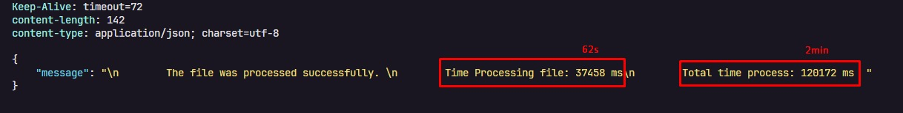

# DataTrail

Uma pequena experiência para processar grandes arquivos .csv convertendo-os em um novo arquivo .json e salvando os registros do arquivo em um banco postgreSQL

## Objetivo

Construir um fluxo completamente simples de uma api que possa processar grandes arquivos `.csv` executando apenas os dois passos abaixo:

- Converter o arquivo em um novo arquivo em `.json`.
- Salvar todos os registros em um banco de dados.

## Tecnologias Utilizadas

- NodeJS
- Typescript
- Fastify
- Zod
- Postgres
- csv-parse
- docker-compose

## Como Utilizar

Para executar a API basta executar os comando de cada passo abaixo.
Caso não queira utilizar o docker basta pular o **passo 1** ajustar a url de conexão do arquivo `postgres.ts`, localizado em `src/lib/postgres.ts`.

**0. Instalar todas as dependencias:**

```bash
  pnpm install
```

**1. Subir banco PostgreSQL:**

```bash
  docker compose up -d
```

**2. Executar scripts para criação das tabelas**

```bash
  pnpm startup
```

**3. Execução da API:**
No arquivo `.env` deve ser definido o caminho do arquivo csv para ser processado. Dentro do diretorio `data-files` deixei um arquivo de exemplo com 500 registros.

Execute o comando abaixo para execução da API:

```bash
  pnpm dev
```

Em seguida basta chamar a rota da api `http://localhost:3333/new-process` para que o arquivo possa ser processado, que resultara em uma nova versão convertidos em .json(que ficara salvo no diretorio `data-files`) e o salvamento de todos os registros no banco de dados.

## Outros Detalhes

Durante o desenvolvimento do fluxo, foi realizado o teste de processamento com arquivos de 500, 1000 e com mais de 800 mil registros. Esse arquivo csv de mais de 800 mil que utilizei para validação final, pode ser encontrado [aqui](https://www.kaggle.com/datasets/adelanseur/taxi-trips-chicago-2024?rvi=1). Se trata de registros de viagens de taxis.

- Processando os mais de 800 mil registros com a abordagem atual do fluxo, tive o seguinte resultado em tempo:
  

## Novidades aprendidas

- Processamento de arquivos utilizando Streams
- Salvamento de registros em lote utilizando o `postgres.js`
- Conceito e utilização do **pipe**.
  - Que de forma simples, o pipe permite encadear operações em uma stream de dados. Como o funcionamento deuma tubulação, onde os dados fluem em cada etapa definida.
- Conhecido a plataforma [kaggle](https://www.kaggle.com/) que também é possivel encontrar e baixar datasets com grandes quantidade de registros
